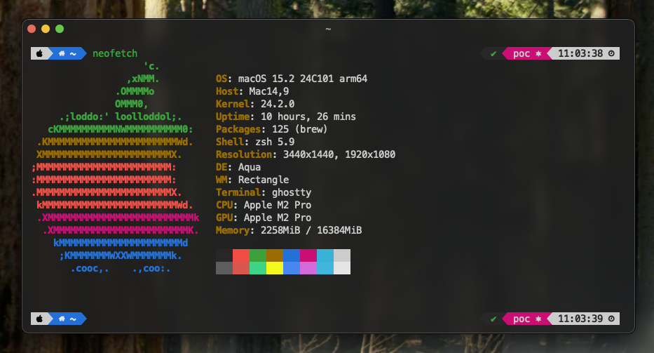
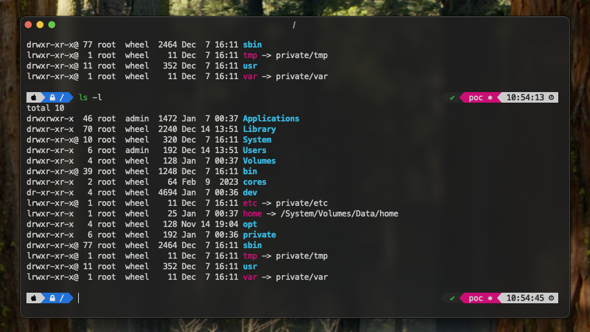

# Custom dotfiles

Some custom dotfiles for macOS, Linux, Windows

## Install

```shell
cd macos
bash provisioning-macos.sh
bash setup-ghostty.sh
```

## Features

### Custom mod
- VIM highlight
- SSH connection reuse
- Enable `tmux` mouse mode (`Ctrl+b` `+m` to turn on, `+M` to turn off)
- Styling shell prompt (zsh)
- Handy aliases

### Automatic software installation
- Install homebrew
- Install applications (List in `Brewfile`)

### Custom setting
- Change some application's language



